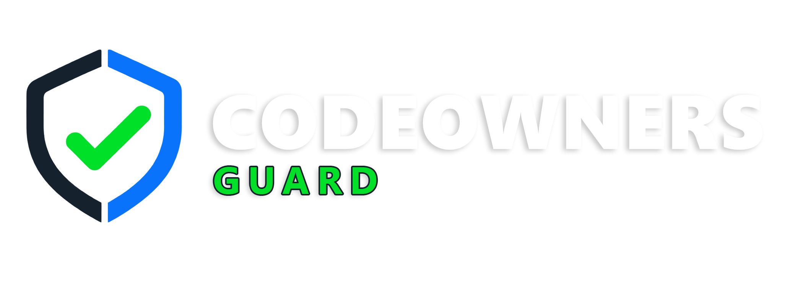

<p align="center">
  
</p>

<h1 align="center">CODEOWNERS Guard</h1>

<p align="center"><strong>Fast, GitHub-native validation for the CODEOWNERS file that GitHub will actually use.</strong></p>

<p align="center">
  <a href="https://github.com/rarepops/codeowners-guard/actions/workflows/ci.yml"></a>
  <a href="https://github.com/rarepops/codeowners-guard/actions/workflows/codeql.yml"></a>
  <a href="https://github.com/rarepops/codeowners-guard/actions/workflows/release.yml"></a>
  <a href="https://github.com/rarepops/codeowners-guard/releases/latest"></a>
  <a href="https://github.com/rarepops/codeowners-guard/releases"></a>
  <a href="LICENSE.md"></a>
  <a href="https://nodejs.org/"></a>
  
  
</p>

<p align="center">
  <a href="https://github.com/rarepops/codeowners-guard/commits/main"></a>
  <a href="https://github.com/rarepops/codeowners-guard/issues"></a>
</p>

CODEOWNERS Guard combines GitHub's own diagnostics with local repository checks. It runs as a native Node.js action, so it works on Linux, macOS, and Windows without pulling a container image.

## Why Guard

- **GitHub is the syntax authority.** Diagnostics come from the same CODEOWNERS API that evaluates the selected branch, tag, or commit.
- **Local checks cover the gaps.** Duplicate patterns, rules that match no tracked file, and files without an effective owner are reported separately.
- **Action-first feedback.** Findings become file annotations and a job summary, with counts exposed as workflow outputs.
- **No container startup.** The Action runs directly on Node.js 24 on Linux, macOS, and Windows runners.
- **Useful outside Actions.** The same core ships as a cross-platform CLI with deterministic text and JSON output.

## Checks

| Check | What it reports | Severity |
| --- | --- | --- |
| `syntax` | Errors returned by GitHub's CODEOWNERS API for the selected ref | Error |
| `duplicates` | A pattern that appears more than once | Warning |
| `dangling` | A pattern that matches no tracked file | Warning |
| `unowned` | A tracked file with no effective owner, including files cleared by an ownerless rule | Warning |

Rules use GitHub's last-match-wins behavior. CODEOWNERS Guard searches the standard locations in GitHub's order: `.github/CODEOWNERS`, `CODEOWNERS`, then `docs/CODEOWNERS`.

When the `syntax` check is disabled, local checks assume the remaining CODEOWNERS lines are valid. Keep `syntax` enabled in the Action, or validate the committed ref with GitHub before relying on local-only coverage results.

See the [check reference](docs/checks.md) for exact matching, exclusion, and result-limit behavior.

## GitHub Action

```yaml
name: CODEOWNERS

on:
  pull_request:
  push:
    branches: [main]

permissions:
  contents: read

jobs:
  validate:
    runs-on: ubuntu-latest
    steps:
      - uses: actions/checkout@3d3c42e5aac5ba805825da76410c181273ba90b1 # v7.0.1
      - uses: rarepops/codeowners-guard@v0.1.1
        with:
          checks: syntax,duplicates,dangling,unowned
          exclude: |
            dist/
            coverage/
```

For the strongest supply-chain pinning, replace `v0.1.1` with its full commit SHA. A complete least-privilege workflow is available in [examples/codeowners.yml](examples/codeowners.yml).

Released tags are exercised from the independent public [integration repository](https://github.com/rarepops/codeowners-guard-integration).

The action adds file annotations and a job summary. Its default token is `${{ github.token }}`, and the workflow only needs `contents: read`.

The Action takes its API endpoint from GitHub's runner environment. It does not accept an endpoint input that could redirect the automatically supplied token. GitHub Enterprise Server runners provide their own trusted `GITHUB_API_URL`.

### Inputs

| Input | Default | Description |
| --- | --- | --- |
| `github-token` | `${{ github.token }}` | Token used for GitHub diagnostics |
| `path` | `.` | Repository path relative to `GITHUB_WORKSPACE` |
| `codeowners` | auto-detect | Explicit CODEOWNERS path |
| `checks` | all checks | Comma-separated checks |
| `exclude` | none | Newline-separated gitignore patterns omitted from local checks |
| `repository` | `${{ github.repository }}` | Repository in `owner/name` form |
| `ref` | `${{ github.sha }}` | Branch, tag, or commit used by the syntax check |
| `fail-on` | `warning` | Failure threshold: `warning` or `error` |
| `max-annotations` | `50` | Maximum workflow annotations and summary rows, up to `100` |

Annotation limits do not change validation counts or failure behavior.

### Outputs

The action returns `valid`, `issue-count`, `error-count`, and `warning-count`.

## CLI

Run the published CLI without installing it globally:

```shell
npx --yes codeowners-guard@0.1.1 . --checks duplicates,dangling,unowned
```

Use `codeowners-guard@latest` instead when you explicitly want the newest release. Pinning a version keeps local and CI runs reproducible.

Build and run the CLI locally:

```shell
npm ci
npm run build
node dist/cli.js .
```

Local checks require no network access:

```shell
node dist/cli.js . \
  --checks duplicates,dangling,unowned \
  --exclude dist/ \
  --format json
```

GitHub's syntax check validates a committed branch, tag, or SHA:

```shell
GITHUB_TOKEN=ghp_example node dist/cli.js . \
  --checks syntax,duplicates,dangling,unowned \
  --repository owner/repository \
  --ref main
```

Tokens are accepted only through `GITHUB_TOKEN` or `GH_TOKEN`; command-line token arguments are deliberately unsupported so credentials do not enter shell history or process listings.

Use `--max-issues` to retain up to 10,000 issue details in text or JSON output. The default is 1,000. Use `--fail-on error` to report local warnings without returning a failing exit status. Exit code `1` means validation failed, and exit code `2` means the command could not run.

See [troubleshooting](docs/troubleshooting.md) for authentication, ref mismatch, missing file, and exit-code guidance.

## Design

GitHub remains the authority for syntax diagnostics. Local checks operate on files returned by `git ls-files`, use a maintained gitignore-compatible matcher, and do not make separate user or team lookup calls. This keeps the Action small and avoids maintaining a second copy of GitHub's owner-resolution behavior.

The syntax check targets `ref`, while local checks target the checked-out working tree. In normal Actions usage both refer to the same commit. For uncommitted local changes, run local checks only or push the change to a ref before requesting GitHub diagnostics.

### Security

- GitHub workflow dependencies are pinned to immutable commit SHAs, and repository settings require SHA-pinned Actions.
- API calls require HTTPS, reject redirects, time out after 15 seconds, cap responses at 1 MiB, and retry only bounded transient failures.
- Action paths and CODEOWNERS files cannot escape the checked-out workspace through traversal or symbolic links.
- Terminal text, workflow annotations, and HTML summaries escape control and bidirectional characters.
- Dependency installation disables lifecycle scripts; CI checks advisories, registry signatures, and dependency diffs.
- Tagged release artifacts include SHA-256 checksums and GitHub build-provenance attestations.

### Performance

- Tracked paths stream from `git ls-files -z`, avoiding a fixed child-process output buffer.
- GitHub diagnostics and tracked-file enumeration run concurrently.
- Each file is normalized once and evaluated against ownership rules in one pass, while duplicate-only checks skip Git entirely.
- Finding details are retained within configured bounds while exact counts and failure behavior cover every finding.
- `npm run bench` measures a 10,000-rule duplicate workload and a 10,000-file by 100-rule ownership workload.

## Development

Requires Node.js 24 or newer.

```shell
npm ci
npm run check
npm run bench
```

`npm run check` includes linting, strict type checking, tests with coverage thresholds, and a production build. `dist/` is committed because GitHub executes JavaScript actions directly from the repository. CI rejects source changes that do not include rebuilt bundles and third-party notices.

## License

CODEOWNERS Guard is source-available under the [PolyForm Perimeter License 1.0.1](LICENSE.md). The license permits use, modification, and redistribution, but does not permit using the software to provide a competing product. Review the license terms before adopting or redistributing the project.

Licenses for packages embedded in the distributed bundles are reproduced in [THIRD_PARTY_NOTICES.md](THIRD_PARTY_NOTICES.md).

Copyright (c) 2026 Rares (rarepops).
